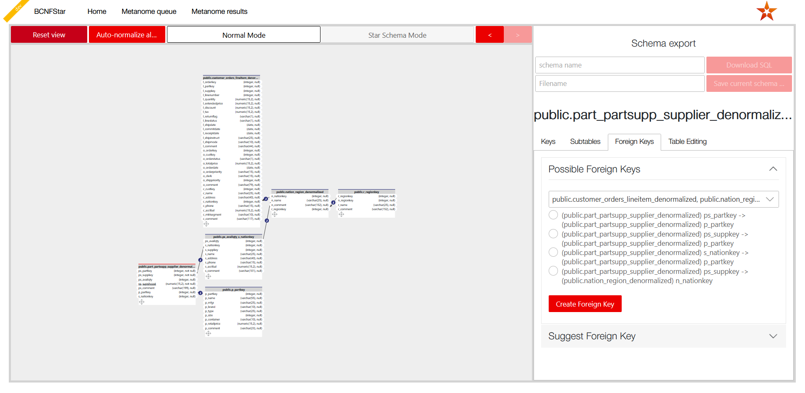

# Schema editing page

The schema editing page allows you to view the imported schema and to transform it.  
Supporting you is a [side bar](./schema_editing_page/sidebar.md) providing different features.  
Also, above the canvas is a menu with six buttons:  

- The first button ***Reset view*** relocates the canvas to the top left corner of the set of tables.  
- The ***Auto-normalize*** button splits either all tables if none are selected or the currently selected table until there are no more functional dependencies left.  
- The ***Normal Mode*** and the ***Star Schema Mode*** button supplement each other, depending on what the user wants to do. In the normal mode general schema transformation is the main purpose.  
In the star schema mode potential fact and dimension tables are highlighted. Moreover, the ***"D"*** button allows you to directly attach a "transitive" dimension table to the fact table.  
Also, the modes differ in the way that foreign keys are displayed.  
- Lastly, the fifth and sixth button provide ***"undo/redo"*** functionality.  
