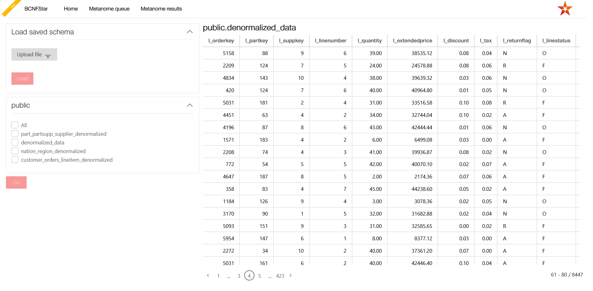

# Home

  

The home tab allows you to import tables in two different ways.  
1. On the left hand side you can use the ***Load saved schema*** option to upload a schema, that you have previously exported from BCNFStar, by selecting the corresponding file. After hitting the ***Load*** button you will be directed to the [schema editing page](../schema_editing_page.md).
2. Beneath that, all schemas found in your database and their tables are displayed.  
Furthermore, by hovering over a table name there will be a preview of the table on the right hand side of the page. This preview displays schema name and table name at the top, the column names, the data in the table and at the bottom right the number of rows and which ones are currently displayed.  
You can select tables by using the checkboxes and then hitting the ***Go*** button. That will then open the [Metanome](metanome.md) dialog which will later also direct you to the [schema editing page](../schema_editing_page.md).