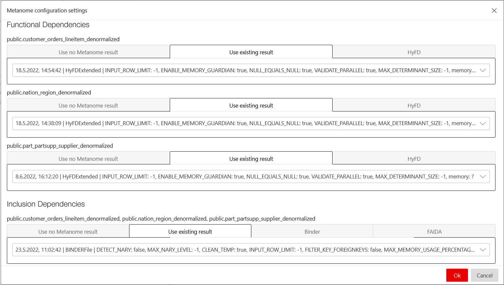
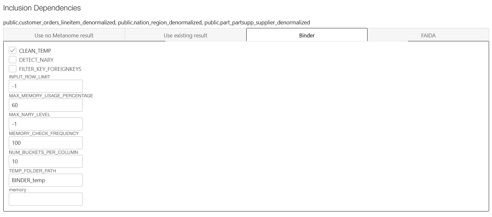
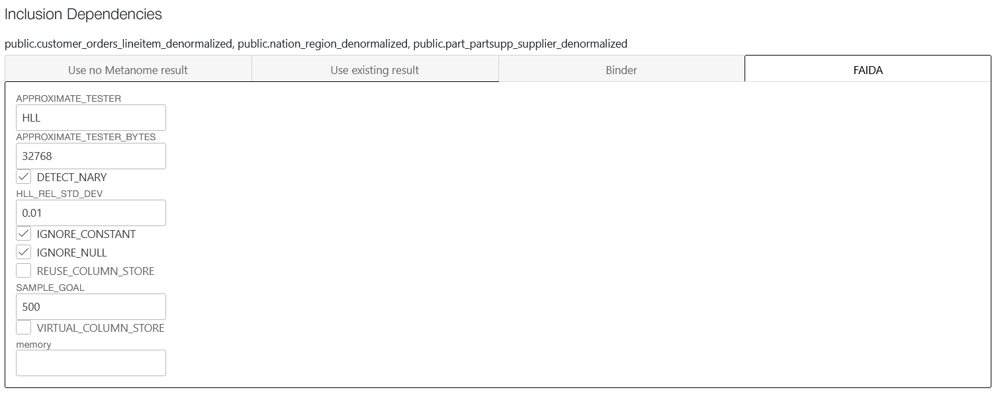

# Metanome

  

[Metanome](https://github.com/HPI-Information-Systems/Metanome) is a collection of algorithms developed at [Hasso-Plattner-Institut](https://hpi.de/naumann/projects/data-profiling-and-analytics/metanome-data-profiling.html) for data profiling tasks.  
When importing tables into BCNFStar the user can either use an existing metanome result for importing metadata (such as functional and inclusion dependencies), use no result at all (i.e. if the user knows all necessary dependencies for transforming the schema) or run a metanome algorithm on the tables.  
Currently supported are the algorithms HyFD for functional dependency discovery and Binder and FAIDA for inclusion dependency discovery. These algorithms can be run with different configurations:  

  
  
  
