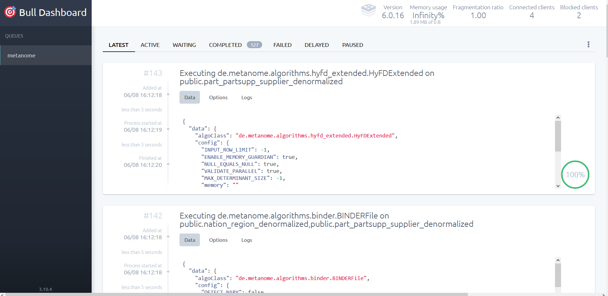

# Metanome queue

  

For queing the [metanome](metanome.md) jobs to be run, i.e. the HyFD algorithm for detecting functional dependencies, we use [Redis](https://redis.io/) (see [Setup](../../README.md)).  

The ***Metanome queue*** tab directs you to a dashboard that allows you to obtain an overview of all jobs that are, i.e. active, waiting, completed etc.  

Moreover, you can view the configuration of an algorithm or the logs that come with running it.  
Also, re-running jobs if they have failed is very easy.  
