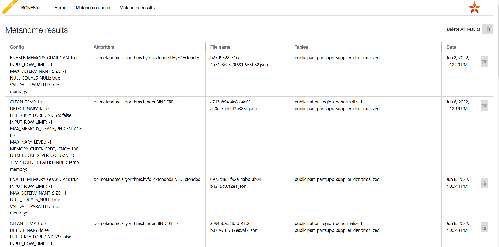

# Metanome results

  

The ***Metanome results*** tab allows you to view all saved results of a [metanome](metanome.md) run.  
The configuration and the algorithm are shown, together with when and on which tables the algorithm has been run.  
Furthermore, the user is given the option to delete results using the *trashcan* button.  
Potentially, the user wants to store metanome results in order to save time and not having to run complex metanome algorithms every time the user wants to use BCNFStar.  
